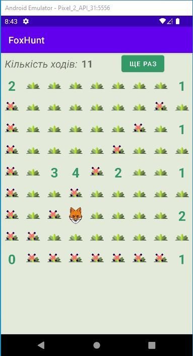

# **FoxHunt**
**FoxHunt**- це проста логічна гра, в яку я грав ще на калькуляторі "Электроника МК-61".   
Вирішив реалізувати на мобільному телефоні.  
### *Правила гри*   
Є поле **9 Х 9**, на якому в довільному порядку розташовані п'ять лисиць.    
Довгим натисканням відкриваємо поле, яке показує або знайдену лисицю,   
або цифру, яка показує скільки з цієї точки видно лисиць по горизонталі, вертикалі та діагоналях.  
Шляхом логічних міркувань знаходимо всіх лисиць за найменшу кількість ходів.  
Коротке натискання- відмічає поле, в якому точно не може бути лисиці.    
Наприклад, на початку гри, відкривши поле з нулем, означає, що ні по горизонталі ні по вертикалі чи діагоналях жодної лисиці бути не може.    
Цю відмітку можна ставити, відміняти чи відкривати поле довгим натисканням- вона жодної логіки не несе.   
Після закінчення гри (п'ять лисиць знайдено) висвітлюється повідомлення.    
В верхній частині екрану підраховано кількість ходів.   
Спробуйте закінчити гру хоча б до **20** ходів.     

